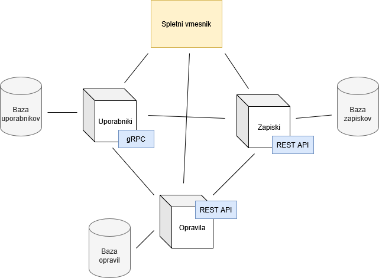

# Beležnik

Storitev za preprosto beleženje zapiskov in opravil, sinhroniziranih preko spleta. 

Namenjena je vsem, ki bi radi zapisovali svoje misli in organizirali opravila brez uporabe pretirano kompleksnih apikacij.
Podatki niso šifrirani, zato storitev ni primerna za zapisovanje občutljivih podatkov.

## Arhitektura

Beležnik je mikrostoritveni sistem, sestavljen iz treh storitev z ločenimi odgovornostmi:
- Uporabniki (registracija, prijava, avtentikacija)
- Zapiski (ustvarjanje in urejanje preprostih besedil)
- Opravila (ustvarjanje in urejanje opravil, spreminjanje statusa opravil)

Storitve med seboj komunicirajo s pomočjo HTTP zahtev, ki vsebujejo ali gRPC ali REST API klice.

